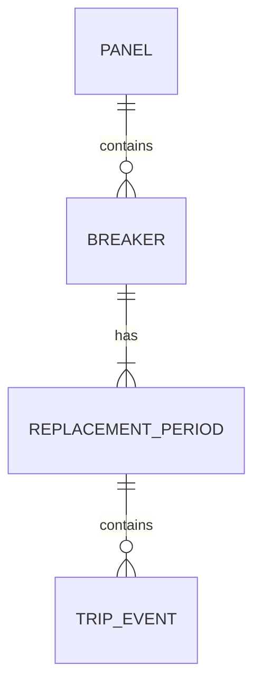
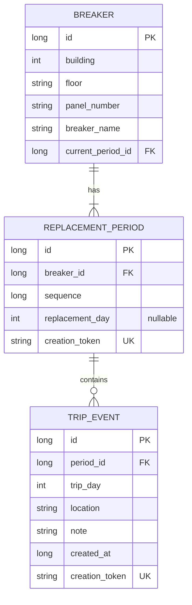

# DB 상세 설계

기준: [requirements.md](requirements.md)의 2026-09-27 확정 사항. Room 스키마 v3를 사용한다. v2에서 분전함·차단기 마스터, 별도 트립사유, 설치 구간 관리를 추가한다. 아래 v2 변경 사항이 이후의 기존 v1 설계보다 우선한다.

## v3 초기 마스터 적재

`initial_data_import(source_key TEXT PRIMARY KEY NOT NULL)` 테이블을 추가한다. MIGRATION_2_3은 이 테이블만 생성하고 기존 테이블·ID·데이터를 유지한다. v1은 MIGRATION_1_2와 함께 순차 업그레이드한다.

DB onOpen에서 `MasterSeed`가 `initial_masters.json`의 두 마스터 시트를 한 번 적용한다. 분전함 164개, 차단기 171개, 최초 설치 구간 171개를 기준으로 기존 동일 키의 마스터는 보존하고 없는 항목만 추가한다. 트립은 생성하지 않는다. 초기 마스터와 `excel-masters-v1` 완료 기록은 같은 트랜잭션으로 저장한다. 완료 기록을 설비와 독립적으로 유지해 사용자 삭제·수정 후 재실행해도 원본으로 복원되지 않는다.

원본 행·명칭과 변환 내역은 [초기 마스터 데이터](excel-import-review.md)에 설명한다. FROM분전함은 특기사항에 표기하며 별도 관계를 추정하지 않는다. 1관 12·13층은 기존 TEXT 층 컬럼을 사용한다.

0.7.0은 같은 `initial_data_import` 테이블에 `excel-masters-remove-spares-v1` 기록을 추가한다. 원본 행 토큰·마스터 값·단일 설치 구간이 일치하고 트립이 없는 초기 SPARE만 한 번 제거한다. 수정·이력이 있는 항목과 수동 등록한 항목은 유지한다. Room 스키마는 v3 그대로다.

## v2 마스터 구조와 이전 데이터 보존

| 테이블 | 추가·변경 필드 | 규칙 |
| --- | --- | --- |
| panel | id, building, floor, number, location, note | 관·층·번호 유일. location은 분전함위치, note는 특기사항 |
| breaker | panel_id, kind, ports, rated_amps, load, note | panel_id FK 삭제 제한. 종류, 양의 정수 port 수, 양의 십진수 A, 장소(부하), 특기사항 |
| replacement_period | 기존 필드 유지 | replacement_day를 설치일자로 표시. null은 설치일 미상 |
| trip_event | reason 추가, note 유지 | reason은 트립사유, note는 기존 비고를 보존한 특기사항. location은 당시 트립장소 |

마이그레이션은 기존 차단기의 관·층·분전함번호를 중복 제거해 panel을 생성하고 panel_id로 연결한다. 기존 차단기·구간·트립 ID와 날짜·등록시각·토큰은 그대로 유지한다. 새 메타데이터는 빈 문자열 또는 null로 두어 ‘미입력’으로 표시한다. 트립장소를 부하로 추정하거나 비고를 트립사유로 옮기지 않는다. 파괴적 fallback은 사용하지 않는다.

기존 breaker의 관·층·분전함번호는 v1 검색 호환을 위해 유지한다. panel 수정과 하위 breaker 식별 필드 동기화는 한 트랜잭션에서 수행한다. panel_id는 SQLite의 기존 테이블 FK 추가 및 기존 하위 API와의 호환을 위해 nullable이지만, 마이그레이션 완료 행과 마스터 저장 경로에는 항상 실제 panel ID를 지정한다. Room Entity는 presentation에 노출하지 않는다.

정격전류는 부동소수점 오차 없이 십진 문자열로 저장하고 BigDecimal로 양수 검증·표준화한다. 장소(부하)는 마스터 속성이며 트립장소와 독립적이다. 마스터 수정은 과거 트립의 장소·사유·특기사항을 바꾸지 않는다.

분전함은 소속 차단기가 있으면 삭제하지 않는다. 차단기는 전체 설치 구간에 트립이 하나라도 있으면 삭제하지 않는다. 트립 없는 차단기 삭제는 현재 참조 해제 → 빈 구간 삭제 → 차단기 삭제를 한 트랜잭션으로 처리한다.

마스터 생성은 트립을 만들지 않는다. 차단기 생성 시 최초 설치 구간을 함께 생성해 0건으로 조회한다. 실제 교체는 새 구간을 생성하고 이전 구간을 보존한다. 날짜 정정은 동일 구간의 날짜만 변경하며, 빈 현재 구간 삭제는 직전 구간을 복원한다. UI에서 복원될 날짜·구간·건수를 먼저 표시한다.

입력 목록은 저장된 마스터·트립을 Flow로 관찰해 공백을 제외하고 중복 제거·정렬한다. 저장 실패한 입력은 목록에 추가되지 않는다. 기기 재실행 후 DB에서 복원하며 외부 서비스로 전송하지 않는다.

집계 행과 상세 팝업은 period_id로 연결한다. 동일 날짜·동일 차단기의 다른 구간을 섞지 않는다. 건수조회에서 관·층은 필수이며 설치일자가 없는 구간도 포함한다.

## 기존 v1 설계 참고

## 1. 데이터 관계

그림의 1개 이상 구간 관계는 정상 저장 완료 시의 상태다. 차단기의 current_period_id는 자신에게 속한 구간 하나를 가리킨다. 실제 발생 날짜, 입력시각, 구간 순서는 서로 다른 값이다.

## 2. 테이블 정의

| 테이블 | 필드 | 저장 및 제약 |
| --- | --- | --- |
| breaker | id | 자동 생성 Long, 기본키 |
| breaker | building, floor | 관 1~4, 확정된 층 코드. 저장 전 값 검증 |
| breaker | panel_number, breaker_name | 정규화한 필수 문자열 |
| breaker | current_period_id | 현재 구간 ID. 최초 생성 트랜잭션 중에는 null 허용, 정상 완료 시 반드시 지정 |
| replacement_period | id | 자동 생성 Long, 기본키. 날짜를 식별자로 쓰지 않음 |
| replacement_period | breaker_id | 소속 차단기 FK |
| replacement_period | sequence | 차단기 내 구간 순서. 날짜 정정·트립 입력으로 변경하지 않음 |
| replacement_period | replacement_day | 날짜를 일 단위 정수로 저장. null은 교체일 미상 |
| replacement_period | creation_token | 생성 요청 식별 문자열, 유일성 제약 |
| trip_event | id | 자동 생성 Long, 기본키·고유 이력번호 |
| trip_event | period_id | 소속 교체 구간 FK |
| trip_event | trip_day | 트립일자, 일 단위 정수, 필수 |
| trip_event | location | 해당 발생 건의 장소, 정규화한 필수 문자열 |
| trip_event | note | 빈 문자열 허용, 문장·줄바꿈 보존 |
| trip_event | created_at | 최초 등록시각, epoch milliseconds. 수정 시 유지 |
| trip_event | creation_token | 생성 요청 식별 문자열, 유일성 제약 |

교체일은 구간에서 가져오므로 트립마다 중복 저장하지 않는다. 장소는 트립별로 저장하여 한 건 수정이 다른 이력의 장소를 바꾸지 않게 한다. 트립횟수와 다음 교체일은 저장하지 않고 조회 시 계산한다.

구간 sequence는 같은 차단기 안에서 유일하게 관리한다. 삭제 후 남은 구간의 순서는 재번호 매기지 않는다. 화면용 고유 구간 번호에는 재사용하지 않는 구간 ID를 사용한다. 이력 ID도 새 기록에 재사용하지 않도록 생성 방식을 검증한다.

생성된 스키마는 `app/schemas/com.triptracker.app.data.local.TripDatabase/1.json`에 보관한다. 세 테이블의 ID는 AUTOINCREMENT이며, 트립일자에는 유일성 제약이 없다. [Room Entity 공식 문서](https://developer.android.com/training/data-storage/room/defining-data)

## 3. 제약 및 인덱스

| 대상 | 설계 |
| --- | --- |
| 같은 차단기 중복 생성 | breaker의 관·층·분전함번호·차단기명 복합 유일 인덱스 |
| 같은 차단기의 구간 순서 중복 | replacement_period의 breaker_id + sequence 유일 인덱스 |
| 트립의 날짜 중복 | 허용. period_id + trip_day에 유일성 제약을 두지 않음 |
| 관계 삭제 | 연결된 자식이 있으면 FK 삭제 제한. 트립 CASCADE 삭제를 사용하지 않음 |
| 구간별 트립 조회·대표 장소 | period_id + trip_day + created_at + id 인덱스 |
| 날짜별 전체 조회 | trip_day + created_at + id 인덱스 |
| 현재 구간 참조 | FK 존재 여부와 함께 소속 차단기 일치를 Repository에서 검증 |

현재 구간 존재·소속 일치·유일한 구간 삭제 제한·날짜 경계는 단일 FK만으로 보장되지 않는다. Repository의 트랜잭션에서 검사하고, DAO를 UI에 직접 노출하지 않는다. 각 제약의 DB 검증과 업무 검증을 구분하여 테스트한다.

## 4. 저장 작업의 원자성

| 작업 | 한 트랜잭션 안에서 처리할 내용 |
| --- | --- |
| 최초 트립 저장 | 차단기 확인/생성 → 최초 구간 생성 → current_period_id 지정 → 트립 저장. 한 트랜잭션으로 구현 |
| 기존 구간 트립 저장 | 구간 소속·날짜 검증 → 트립 생성 |
| 실제 교체 | 현재 구간 재확인·날짜 검증 → 다음 sequence로 구간 생성 → 현재 구간 참조 변경 |
| 교체일 정정 | 날짜 변경 후 경계 검증 → 동일 구간 날짜 갱신. 기존 트립·현재 참조 유지 |
| 트립 수정 | 대상 ID 재확인 → 대상 구간·날짜 검증 → 같은 ID의 필드와 구간 연결 수정 |
| 트립 복수 삭제 | 선택한 ID들만 삭제. 일부만 지워진 상태로 완료하지 않음 |
| 빈 현재 구간 삭제 | 트립 0건·다른 구간 존재 확인 → 직전 구간으로 현재 참조 변경 → 빈 구간 삭제 |
| 빈 과거 구간 삭제 | 트립 0건·유일 구간 아님 확인 → 구간 삭제, 현재 참조 유지 |

생성 중 실패하면 신규 차단기나 구간만 남기지 않는다. 현재 구간 삭제에서는 참조를 먼저 옮긴 뒤 삭제해 FK를 유지한다.

동일 저장 요청의 재시도에는 같은 creation_token을 사용하고, 별도로 등록하는 실제 발생 건에는 새 토큰을 부여하는 기술안을 사용한다. 저장 중 버튼 비활성화와 DB 유일성 검사를 함께 적용한다. 같은 토큰이 이미 저장됐다면 기존 ID와 동일 요청 내용을 확인하여 결과를 반환하고 덮어쓰지 않는다. 삭제된 기록에 대한 과거 요청을 자동 재실행하는 영구 작업 큐는 만들지 않는다.

## 5. 조회 구현 계약

| 조회 | 반환 기준 |
| --- | --- |
| 상세 검색 | trip → period → breaker 연결, 선택 조건 AND, 코드 포함 검색은 바인딩 값 사용 |
| 상세 정렬 | trip_day DESC → created_at DESC → id DESC |
| 구간별 집계 | period를 기준으로 트립을 LEFT JOIN, COUNT(trip.id). 트립이 없어도 0회 |
| 현재·이전 필터 | breaker.current_period_id와 구간 ID 비교 |
| 대표 장소 | 해당 구간의 trip_day DESC → created_at DESC → id DESC 첫 이력. 없으면 null, UI에서 ‘—’ |
| 구간 조회 | 현재 구간 먼저, 나머지는 sequence DESC |
| 다음 교체일 | 같은 차단기의 다음 sequence 구간에서 조회. 미상 날짜는 미상으로 유지 |

집계는 반드시 구간 ID로 묶는다. COUNT(*)를 사용해 트립 없는 구간을 1회로 세거나, 날짜로 묶어 같은 날 두 발생 건을 하나로 합치지 않는다. 대표 장소 조회 때문에 집계 행이 중복되지 않도록 장소는 단일 행으로 선택한다.

문자열 부분 검색은 정규화한 검색어를 바인딩한 `instr`로 구현했다. %, _ 및 역슬래시도 문자 자체로 처리하며 빈 검색어는 제한하지 않는다. 포함 검색 성능은 데이터량에 따라 실제 조회 계획을 확인하며, 일반 인덱스가 모든 포함 검색을 빠르게 만든다고 가정하지 않는다.

변경 결과는 DAO의 Flow로 전달하고, UI는 ViewModel의 상태를 관찰한다. 저장은 suspend 작업으로 수행한다. [Room 비동기 조회 공식 문서](https://developer.android.com/training/data-storage/room/async-queries)

## 6. 수정 범위

트립 한 건의 관·층·분전함번호·차단기명 수정은 대상 차단기 및 구간을 다시 지정하는 방식으로 구현했다. 공유하는 breaker 행은 이름 변경하지 않는다. 대상 차단기가 없으면 확정된 최초 등록 폼에서 마지막 교체일자 또는 미상을 입력해 대상 차단기·최초 구간을 만들고 기존 트립 ID를 연결한다. 신규 트립은 생성하지 않으며 실패 시 대상 생성도 롤백한다.

트립 UPDATE는 period_id·trip_day·location·note만 변경하여 ID·created_at·creation_token을 보존한다. 복수 삭제는 확인한 ID 집합을 한 트랜잭션에서 처리한다. 삭제 실패 시 앞서 삭제한 행도 복원하며, 마지막 트립 삭제 후에도 차단기·구간은 0회로 유지한다.

교체일 정정은 공통 구간 정보의 변경이므로 해당 구간의 여러 이력에 정정된 날짜가 표시되는 것이 의도된 동작이다. 트립의 장소·비고 수정은 그 한 건에만 적용한다.

## 7. 변경·마이그레이션

Room 스키마를 내보내 버전 관리하고, 스키마 변경 시 이전 데이터를 가진 DB에서 마이그레이션을 검증한다. 개발 편의를 위한 DB 삭제로 운영 이력을 잃지 않도록 파괴적 마이그레이션 fallback을 사용하지 않는다. [Room 마이그레이션 공식 문서](https://developer.android.com/training/data-storage/room/migrating-db-versions)

## 8. 구현 검증 우선순위

| 우선 검증 | 연결되는 기존 테스트 |
| --- | --- |
| 같은 날 두 건 보존·정확한 집계 | REG-05, COUNT-02 |
| 미상 구간·0회 구간 조회 | REG-09, COUNT-03, COUNT-08 |
| 현재 참조의 소속·존재, 교체 후 보존 | COUNT-04~05, PERIOD-06~07 |
| 한 건 수정·삭제가 다른 행에 영향 없음 | EDIT-02, DEL-02, PERIOD-08 |
| 부분 저장·중복 요청 방지 | INIT-02, SAVE-01, PERIOD-09 |
| 날짜 정정과 인접 구간 검증 | PERIOD-01~03 |
| 최신 장소 선택·집계 행 중복 없음 | DISPLAY-01~02 |

추가 DB 계약 테스트: 잘못된 부모 ID 거절, 다른 차단기의 구간을 현재로 지정하는 요청 거절, 차단기 생성 경쟁 시 중복 방지, FK 삭제 제한, ID 재사용 방지. 실행 가능한 테스트는 앱 기반 구성 후 먼저 작성한다.

## 0.8.0 관·층과 부모 선택

DB 스키마는 v3를 유지한다. 차단기의 부모는 기존 `panel_id`이며 관·층은 등록·수정 화면에서 부모를 선택하기 위한 조건이다. ViewModel에서 선택한 부모의 관·층 일치를 검증하고 저장 시 Repository가 부모 정보를 기준으로 식별 정보를 구성한다. 별도 관·층 컬럼을 추가하지 않는다.

화면의 MasterFilter에 선택한 `panelId`를 보관한다. 선택 조회는 해당 ID의 관·층·번호 전체를 대조하고, 번호 입력값의 부분 검색은 기존 문자열 조건을 유지한다. 초안과 적용 조건을 분리해 필터를 편집하는 동안 기존 결과·생략된 소속 정보가 바뀌지 않게 한다.
