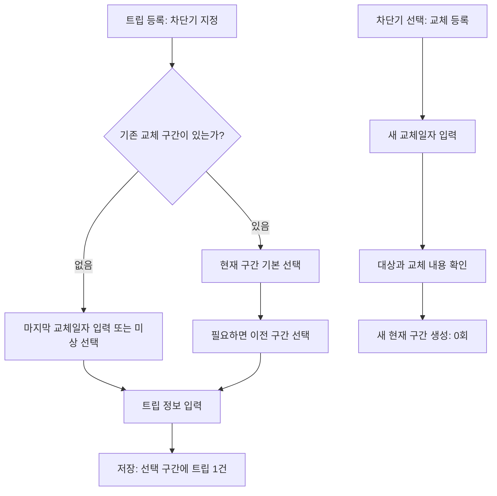

# 교체 등록 및 최초 구간 생성 설계안

상태: 최초 트립과 차단기·최초 구간을 한 번에 저장하는 방식은 사용자 확정 후 구현했다. 기존 차단기의 구간 선택·트립 추가도 구현했다. 새 교체 등록 화면은 검토용 설계다. [requirements.md](requirements.md)가 확정 규칙의 기준이다.

추가 확정: 마지막 교체일자를 모르는 기존 차단기도 ‘교체일 미상’으로 등록할 수 있다.

수정·삭제 및 날짜 정책 확정: 7~9절의 교체일 정정, 구간 삭제, 날짜 검증 규칙은 requirements.md에 반영했다. 화면 배치·문구 등 UI 제안과 구분한다.

## 1. 흐름 요약

| 상황 | 사용자 작업 | 저장 결과 |
| --- | --- | --- |
| 처음 기록하는 차단기에 트립 발생 | 차단기 정보·트립 정보 입력, 마지막 교체일자 입력 또는 ‘교체일 미상’ 선택 | 차단기 + 최초 구간 + 트립 1건, 횟수 1회 |
| 등록된 차단기에 트립 발생 | 현재 구간 기본 선택 상태로 트립 등록 | 현재 구간에 트립 1건 추가 |
| 과거 트립을 뒤늦게 입력 | 이전 구간 선택 후 트립 등록 | 선택한 이전 구간에만 트립 1건 추가 |
| 실제로 차단기를 교체 | 대상 차단기의 교체 등록에서 새 교체일자 입력 | 새 현재 구간 생성, 0회부터 집계, 과거 구간 보존 |

최초 입력의 ‘마지막 교체일자’는 이미 설치된 차단기의 사용 구간을 기록하는 값이다. 오늘 새로 교체했다는 의미로 처리하지 않는다.

## 2. 최초 트립 등록 화면

확정·구현: 별도의 차단기 사전 등록 없이 첫 트립 입력 중 차단기와 최초 구간을 함께 생성한다. 저장 실패 시 일부 데이터만 남기지 않는다.

| 화면 항목 | 표시 및 동작 |
| --- | --- |
| 관·층·분전함번호·차단기명 | 기존 등록 규칙에 따라 입력. 해당 조합으로 기존 차단기 확인 |
| 장소 | 원문 등록 항목에 따라 입력 |
| 구간 안내 | 기존 구간이 없으면 ‘마지막 교체일자를 입력하세요. 모르면 교체일 미상을 선택하세요.’ 표시 |
| 마지막 교체일자 | 캘린더로 선택하거나 ‘교체일 미상’ 선택. 임의 날짜로 대체하지 않음 |
| 트립일자 | 오늘 기본값, 캘린더로 변경 가능 |
| 비고 | 트립에 대한 비고 입력 |
| 저장 | 입력 검증 후 최초 구간과 트립을 함께 저장 |

최초 차단기·구간·트립 생성은 하나의 트랜잭션으로 처리한다. 취소하거나 저장에 실패하면 일부 데이터만 남기지 않는다. 기존 차단기가 발견되면 그 차단기를 사용하며, 식별 필드를 변경하면 구간 선택도 다시 확인한다.

마지막 교체일자를 모르면 ‘교체일 미상’으로 등록할 수 있다. 교체일자를 null로 저장하고 구간 ID로 연결·집계하는 안을 제안한다. 현재·이전 구간 모두 날짜 대신 ‘교체일 미상’으로 표시하며, 날짜 미상과 입력을 아직 완료하지 않은 상태는 폼에서 구분한다.

## 3. 기존 차단기의 트립 등록 화면

| 화면 항목 | 표시 및 동작 |
| --- | --- |
| 교체 구간 | 현재 구간 기본 선택. 같은 차단기의 이전 구간도 선택 가능 |
| 구간 표시 | ‘현재 · 2026-09-15 교체’, ‘이전 · 2025-05-21 교체’처럼 표시 |
| 같은 날짜의 여러 구간 | 화면용 구간 번호를 함께 표시하여 구분. 사용자가 번호를 입력하지 않음 |
| 교체일자 | 선택한 구간의 날짜 표시. 구간 선택과 교체 기록 수정은 별도 동작으로 취급 |
| 트립일자·장소·비고 | 트립 정보 입력 |
| 저장 | 선택 구간에 트립 한 건 추가, 해당 구간 횟수 갱신 |

과거 구간을 선택해도 그 구간이 현재 구간으로 바뀌지 않는다. 트립 수정 화면은 원래 연결된 구간을 초기값으로 사용한다.

## 4. 교체 등록 화면

횟수 조회에서 차단기를 선택한 뒤 ‘교체 등록’으로 진입하는 안이다. 구간별 결과 중 과거 구간을 보고 있어도 교체 대상 차단기와 실제 현재 구간을 명확히 표시한다.

| 화면 항목 | 표시 및 동작 |
| --- | --- |
| 대상 차단기 | 관·층·분전함번호·차단기명 표시 |
| 현재 교체일자 | 현재 구간의 교체일자 표시 |
| 현재 트립 횟수 | 현재 구간의 횟수 표시 |
| 새 교체일자 | 오늘 기본값, 캘린더로 변경 가능 |
| 교체 등록 버튼 | 대상과 날짜를 확인하는 대화상자 표시 |
| 확인 문구 예시 | ‘1관 3층 LP-3-A / R1의 교체를 등록할까요? 새 트립 횟수는 0회로 시작하며 이전 기록은 보존됩니다.’ |
| 완료 | 해당 차단기의 새 현재 구간과 0회 표시 |

교체 등록에는 트립일자를 입력받지 않고 트립 행을 생성하지 않는다. 기존 구간을 과거 구간으로 전환하고 새 현재 구간을 생성하는 작업은 하나의 트랜잭션으로 처리한다. 실패·취소 시 기존 현재 구간을 유지한다.

차단기마다 현재 구간 하나를 명시적으로 관리하는 안이다. 최근에 트립이 입력된 구간이나 교체일자 최대값만으로 현재 구간을 추측하지 않는다. 같은 날 두 번 교체한 경우도 서로 다른 구간으로 구분할 수 있도록 설계한다.

## 5. 입력 검증 및 저장 제안

| 상황 | 제안 동작 | 상태 |
| --- | --- | --- |
| 필수 식별 정보 누락 | 해당 항목 안내 후 저장 제한 | 확정 |
| 최초 교체일 미상 선택 | 날짜 없이 최초 구간·트립 저장 허용 | 확정 |
| 날짜도 미상도 선택하지 않음 | 날짜 입력 또는 미상 선택 안내 | 확정 |
| 미래 트립일자·교체일자 | 실제 발생 이력만 기록하도록 저장 제한 | 확정 |
| 트립일자가 선택 구간의 시작일보다 빠름 | 시작일이 알려진 구간에서 날짜·구간 수정 안내 후 저장 제한. 미상 구간은 알 수 없는 시작일을 추정하여 검사하지 않음 | 확정 |
| 과거 구간의 다음 교체일보다 늦은 트립일자 | 다른 구간 선택 안내 후 저장 제한 | 확정 |
| 트립일자가 교체 경계일과 같음 | 이전·현재 구간 중 사용자 선택을 따름 | 날짜만으로 전후 판별 불가, 기존 확정 규칙 적용 |
| 새 교체일자가 현재 구간 시작일보다 빠름 | 시작일이 알려진 경우 일반 교체 등록에서 저장 제한. 미상 시작일과 비교하지 않음. 과거 교체 삽입은 별도 설계 | 확인 필요 |
| 새 교체일자보다 늦은 트립이 현재 구간에 이미 존재 | 기존 이력 확인 안내 후 교체 등록 제한. 이력을 자동 이동하지 않음 | 확인 필요 |
| 저장 버튼 연속 클릭 | 저장 중 버튼 비활성화, 같은 저장 요청은 한 번만 처리 | 구현 제안 |
| 별도로 입력한 실제 다회 트립 | 값이 같아도 각각 저장 | 확정 |

저장 실패 시 입력값을 유지하고 재시도할 수 있게 한다. 실제 다회 트립 허용과 동일 저장 요청 재처리 방지는 별개의 규칙으로 검증한다.

## 6. 검증 시나리오

최초 생성 INIT-01~04와 트립 저장 요청 중복 방지는 로컬 테스트로 구현했다. 실제 교체 등록 REPLACE 시나리오는 후속 테스트 계획이다.

| ID | 시나리오 | 기대 결과 |
| --- | --- | --- |
| INIT-01 | 처음 보는 차단기에 첫 트립 저장 | 차단기 1개, 최초 구간 1개, 트립 1건, 횟수 1회 |
| INIT-02 | 첫 등록 저장 실패·취소 | 차단기·구간·트립의 부분 저장 없음 |
| INIT-03 | 같은 차단기에 두 번째 트립 저장 | 기존 차단기·구간 재사용, 트립 2건 |
| INIT-04 | 교체일 미상으로 첫 트립 저장 | 날짜 없는 구간에 트립 1건 연결, 1회 집계 및 ‘교체일 미상’ 표시 |
| REPLACE-01 | 현재 3회인 차단기 교체 | 이전 구간 3회 보존, 새 현재 구간 0회 |
| REPLACE-02 | 교체 확인 취소·저장 실패 | 구간 추가 없음, 기존 현재 구간과 3회 유지 |
| REPLACE-03 | 교체 후 이전 구간에 과거 트립 추가 | 이전 구간만 4회, 새 현재 구간 0회 유지 |
| REPLACE-04 | 교체 당일 전후 트립 각각 등록 | 같은 날짜라도 선택한 구간별로 1건씩 연결 |
| REPLACE-05 | 같은 날 실제 두 번 교체 | 별도 구간으로 구분, 가장 나중에 교체 등록한 구간을 현재로 관리 |
| SAVE-01 | 같은 저장 요청 연속 실행 | 구간·트립 중복 생성 없음 |

## 7. 교체일 정정 화면 제안

업무 규칙 확정. 아래 화면 구성은 해당 규칙을 적용하는 UI 제안이다.

구간 상세에서 ‘교체일 수정’으로 진입한다. 실제 교체 등록과 날짜 정정을 별도 동작으로 둔다.

| 항목 | 동작 제안 |
| --- | --- |
| 대상 | 차단기 식별 정보, 현재·이전 구분, 구간 번호 표시 |
| 수정 전 | 기존 교체일자 또는 ‘교체일 미상’, 연결된 트립 건수 표시 |
| 수정 후 | 캘린더로 올바른 날짜 선택 |
| 미상 날짜 보완 | 미상 구간에 나중에 확인한 날짜를 입력해도 기존 구간을 유지 |
| 저장 전 안내 | ‘이 구간의 교체일자가 변경됩니다. 연결된 트립 N건과 횟수는 유지됩니다.’ |
| 저장 결과 | 동일 구간의 날짜만 변경. 해당 구간의 상세·횟수 조회에 정정한 날짜 반영 |

날짜를 정정해도 새 구간을 만들거나 트립을 추가하지 않는다. 현재·이전 상태와 구간 순서도 유지한다. 트립 한 건의 수정 화면에서 교체일자를 바꾸는 대신, 구간을 바꾸거나 위 정정 화면에서 공통 날짜를 고치도록 한다.

다른 구간과 날짜 순서가 뒤집히거나, 정정 후 기존 트립일자가 구간 범위를 벗어나면 문제 이력과 날짜를 보여주고 저장을 제한한다. 날짜만 바꿔 트립을 자동 이동하지 않는다. 미상 구간에는 알 수 없는 시작일 검증을 적용하지 않되, 알려진 다음 교체일 등 확인 가능한 경계는 검사한다.

## 8. 교체 구간 삭제 규칙 (확정)

여기서 삭제는 잘못 등록한 교체 구간의 정리를 뜻한다. 실제 교체는 기존 확정 규칙대로 이전 구간을 보존한다.

| 대상 상태 | 동작 | 결과 |
| --- | --- | --- |
| 트립이 연결된 구간 | 삭제 제한, ‘트립 N건이 연결되어 있습니다. 이력의 구간을 먼저 확인하세요.’ 표시 | 구간과 트립 모두 유지 |
| 트립 0건인 과거 구간 | 대상 확인 후 삭제 | 나머지 구간·트립·현재 구간 유지 |
| 트립 0건인 현재 구간, 이전 구간 있음 | 직전 구간이 현재로 복원됨을 알리고 확인 후 삭제 | 직전 구간의 기존 횟수가 현재 횟수로 다시 표시됨 |
| 차단기에 남은 유일한 구간 | 삭제 제한, 잘못된 날짜는 수정으로 처리 | 구간 없는 차단기가 생기는 상황 방지 |

현재 구간 삭제의 예: 이전 구간 3회 → 잘못 교체 등록하여 현재 0회 → 빈 현재 구간 삭제 → 기존 구간이 현재 3회로 복원된다. 이 동작은 실제 교체 후 0회 시작과 구분해야 한다.

트립이 잘못된 구간에 연결됐다면 트립 수정에서 올바른 구간을 지정한다. 예를 들어 A 구간 2회·B 구간 1회에서 B의 한 건을 A로 옮기면 A 3회·B 0회가 된다. 트립 ID와 전체 3건은 유지한다. 실제 발생한 트립을 구간 삭제를 위해 지우도록 안내하지 않는다.

삭제 전 검사·구간 삭제·현재 구간 복원은 한 트랜잭션으로 처리한다. 화면에서 0회였어도 저장 시점에 다시 검사한다. 실패 시 모든 변경을 취소한다. 구간 삭제에 트립 일괄 삭제나 자동 합치기를 포함하지 않는다.

## 9. 날짜 정합성 규칙 (확정)

| 검사 | 적용 방법 |
| --- | --- |
| 오늘 기준 | 기기 현지 날짜를 사용, 테스트에서는 현재 날짜를 주입 |
| 트립 날짜 | 알려진 구간 시작일 이상, 다음 구간 시작일 이하 허용 |
| 교체 경계일 | 전후 구간 모두 같은 날짜의 트립을 가질 수 있으며 사용자 선택으로 연결 |
| 교체 순서 | 알려진 교체일은 구간 순서대로 감소하지 않아야 함. 같은 날짜는 허용 |
| 미상 날짜 | 가짜 날짜나 최소 날짜로 대체하지 않음. 비교 가능한 날짜만 검사 |
| 구간 날짜 정정 | 대상 구간과 영향을 받는 인접 구간의 트립을 함께 검증 |
| 미래 날짜 | 실제 발생 이력의 날짜로 사용하지 않도록 저장 제한 |

이전 구간의 시작일을 바꾸면 그 앞 구간의 종료 경계도 달라지므로 해당 구간의 트립만 검사해서는 부족하다. 검사 오류는 ‘트립일 2026-09-14가 변경할 교체일 2026-09-15보다 빠릅니다.’처럼 수정할 내용을 구체적으로 표시한다.

뒤늦게 알게 된 과거 교체를 기존 구간 사이에 끼워 넣는 기능은 날짜 정정과 다르다. 현재까지 확정된 ‘과거 트립 입력’만으로 이 기능을 포함하지 않으며, 필요한 경우 구간 분할과 트립 재배정 절차를 별도로 설계한다.

## 10. 수정·삭제 추가 검증 계획

| ID | 시나리오 | 기대 결과 (확정 규칙 기준, 테스트 미구현) |
| --- | --- | --- |
| PERIOD-01 | 미상 구간의 날짜를 보완 | 구간 ID, 연결된 트립 ID, 횟수, 현재 여부 유지 |
| PERIOD-02 | 이전 구간의 날짜를 정정 | 해당 구간의 조회 날짜 반영, 현재 구간과 전체 건수 유지 |
| PERIOD-03 | 날짜 정정이 인접 구간 트립과 충돌 | 충돌 안내, 저장 전 상태 유지 |
| PERIOD-04 | 트립이 있는 구간 삭제 요청 | 삭제 제한, 구간·트립·횟수 모두 보존 |
| PERIOD-05 | 빈 과거 구간 삭제 | 현재 구간 및 모든 트립 유지 |
| PERIOD-06 | 잘못 만든 빈 현재 구간 삭제 | 직전 구간이 현재로 복원되고 기존 3회 표시 |
| PERIOD-07 | 유일한 구간 삭제 요청 | 삭제 제한 |
| PERIOD-08 | 트립의 연결 구간 수정 | ID·전체 건수 유지, 원래 구간 -1회·대상 구간 +1회 |
| PERIOD-09 | 삭제 직전 트립 추가 또는 저장 실패 | 트립이 있는 구간 삭제 방지, 부분 변경 없음 |

## 11. 정책 확정 상태

교체일 정정 시 기존 구간과 횟수 유지, 트립이 있는 구간 삭제 제한, 빈 현재 구간 삭제 시 직전 구간 복원, 날짜 모순 시 저장 제한을 확정했다. 최초 생성 화면은 확정·구현했으며 새 교체 등록 화면은 후속 검토 대상이다.
